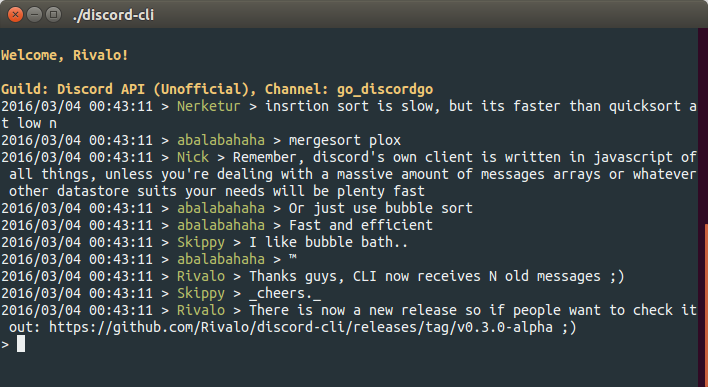

# discord-cli-token
Minimalistic Command-Line Interface for Discord

Join our Discord Chat! https://discord.gg/0pXWCo5RQbVuFHDM

Disclaimer: Currently only tested on Linux.

### How to Install?
* Install the Go Tools and setup the `$GOPATH` (There are loads of tutorial for this part)
* `$ go get -u github.com/sylveon/discord-cli-token`
* Go to the `bin` folder inside your `$GOPATH`
* `./discord-cli-token`

### Configuration Settings
Configuration files are being stored in JSON format and are automatically created when you first run discord-cli-token. Do not change the 'key' value inside `{"key":"value"}`, this is the part that discord-cli-token uses for parsing, missing keys will definitely return errors.

| Setting       | Function         |
| ------------- |-------------|
| token      | Discord Token |
| messagedefault| (true or false) Display messages automatically|
| messages   | Amount of Messages kept in memory |

NOTE: The Configuration settings are likely to change. Breaking updates are stated in the release section. To solve problems, delete `~/.config/discord-cli-token/config.json` and restart discord-cli-token.

### Chat Commands
When inside a text channel, the following commands are available:

| Command                        | Function         |
| ------------------------------ |-------------|
| :q                             | Quits discord-cli-token |
| :g                             | Change listening Guild|
| :c                             | Change listening Channel inside Guild |
| :m [n]                         | Display last [n] messages: ex. `:m 2` displays last two messages |
| <kbd>Ctrl</kbd> + <kbd>L</kbd> | Clears the chat history |
| <kbd>	&uarr;</kbd>/<kbd>&darr;</kbd>   | Searches back and forward in your past sent messages (similar to terminal history) |
